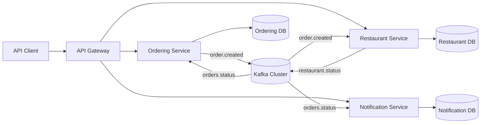

# System Architecture

The distributed food ordering platform demonstrates a modular, message-driven backend intended for teaching core COMP41720 architecture principles. The design intentionally emphasizes trade-off analysis between scalability, operational overhead, resilience, and security.

## Context Diagram

## Service Responsibilities

| Service | Responsibilities | Tech Stack |
| --- | --- | --- |
| Ordering Service | Customer order intake, validation, persistence, publication of lifecycle events, ingestion of downstream status updates | Spring Boot, REST, PostgreSQL, Kafka, Resilience4j |
| Restaurant Service | Menu/catalog management, kitchen orchestration, transformation from synchronous requests to asynchronous kitchen events | Spring Boot, PostgreSQL, Kafka |
| Notification Service | Event fan-out to user-facing channels with retry/backoff hooks, operational tracking of notifications | Spring Boot, PostgreSQL, Kafka |
| API Gateway | Single entry point, JWT validation, rate limiting, mTLS enforcement (Kubernetes) | Traefik or Spring Cloud Gateway |

Each service owns its database to avoid shared-schema coupling, enabling independent scaling and schema evolution.

## Deployment Topology

- **Local development**: Docker Compose orchestrates Kafka, PostgreSQL instances, microservices, and Traefik. Developers can iterate quickly with hot reload via `spring-boot:run`.
- **Kubernetes**: Each service ships with a Deployment + Service manifest, ConfigMaps for non-secret configuration, and Secrets for credentials. Horizontal scaling is achieved via replica counts, while readiness probes ensure rolling updates do not drop traffic.
- **Cloud interoperability**: Manifests target any CNCF-compliant cluster (AKS/EKS/GKE). External dependencies (managed Kafka/PostgreSQL) can replace in-cluster components with minimal config tweaks.

## Communication Patterns

- REST is used for customer-facing flows (order placement, menu browsing) to simplify API consumption and leverage HTTP semantics (idempotent GETs, etc.).
- Kafka topics (`orders.created`, `restaurant.status`, `orders.status`) propagate eventual consistency, enabling loose coupling between Ordering, Restaurant, and Notification services.
- Circuit breaker + retry logic protects Ordering from Restaurant outages by gracefully failing before threads saturate.

## Fault Tolerance & Observability

- **Resilience4j** wraps the Ordering → Restaurant availability check with circuit breakers and retries.
- **Idempotent consumers**: Restaurant and Notification services store derived state (`order_tickets`, `notifications`) keyed by order IDs, allowing safe replays.
- **Actuator endpoints** expose readiness/liveness signals for orchestrators.
- **Structured logging** (JSON-friendly) is available via SLF4J; instrumentation hooks in `docs/implementation-guide.md` describe wiring OpenTelemetry exporters.

## Security Considerations

- API Gateway terminates TLS, validates JWTs, and enforces baseline rate limits before requests reach microservices.
- Each service uses distinct database credentials, modeled as Kubernetes Secrets or Compose env vars to reduce blast radius.
- mTLS between services can be enforced at the gateway mesh by injecting service meshes (Linkerd/Istio). The manifests include placeholders for trust-bundle distribution.
- Zero-trust posture: assume the network is hostile, rely on per-service auth, and validate Kafka event schemas.

## Trade-off Analysis Snapshot

| Decision | Benefits | Costs / Mitigations |
| --- | --- | --- |
| Microservices with database-per-service | Enables independent scaling, clearer ownership boundaries | Added operational overhead (multiple DBs); mitigated by IaC and shared observability
| Kafka-based choreography | Decouples kitchen + notification logic, allows async recovery | Eventual consistency, added infra; mitigated by idempotent consumers and schema governance
| Kubernetes deployment | Portable, declarative scaling and resilience | Higher learning curve; mitigated by Compose for dev + detailed runbook
| API Gateway with JWT + rate limiting | Centralized policy enforcement, zero-trust alignment | Single control-plane dependency; mitigated via HA deployment and fallback static routes

Refer to the ADR folder for deeper analysis of each major decision.
